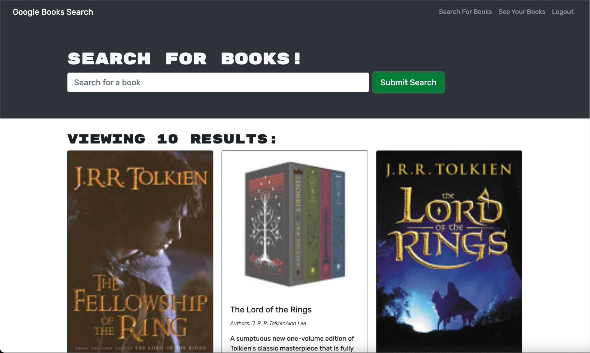

# Google Books

## Description

Google Books is a website where users can search for books, provided by the google books api. If logged in a user can save their favourite books in a reading list.

## Website

[Deployed Website](https://polar-headland-73491.herokuapp.com/)

## Technologies

*Created With*
* React
* MongoDB/Mongoose
* Third Party APIs

## Contribution
Made with ❤️ by Samantha Urwin